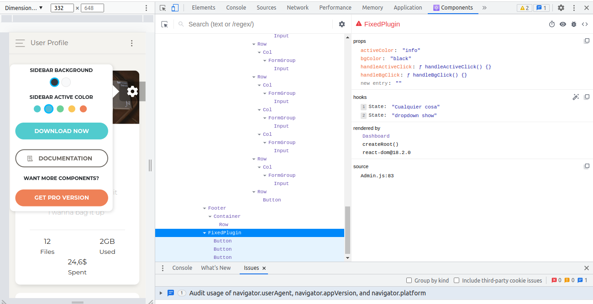
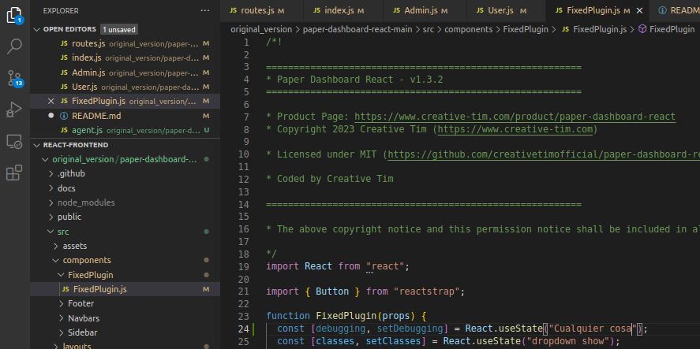

# react-frontend

## day after day building this thing

0. source
    1.  https://github.com/khaledosman/react-redux-realworld-example-app/tree/master
    2.  waaaaaaaaayyyyyyyy better desigsns in : https://www.creative-tim.com/templates/react-free
1. Docker container
    1.  docker build -t my-insights-app . 
    2.  docker run -p 3000:3000 -it --rm -v "$PWD":/home/ --name my-running-app my-insights-app 
    3.  docker exec -it 7d10f8a2560b  bash
    4.  node -v
    5.  npm -v
    6.  npx create-react-app insight-app
    7.  cd my-app
    8.  npm start
    9.  docker cp 7d10f8a2560b:/home/my-app  $(pwd)/v1/
2. I'll need the react dev tool
    1.  https://react.dev/learn/react-developer-tools
    2.  and for debugging I am using the useState (useDebugVelue did not worked)
    
    
3. Following the instructions of this guy
    1.  https://www.youtube.com/watch?v=0W6i5LYKCSI